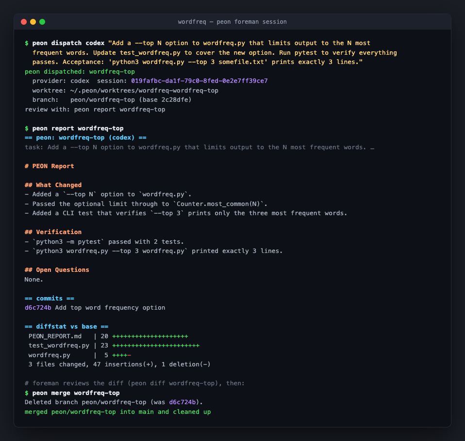
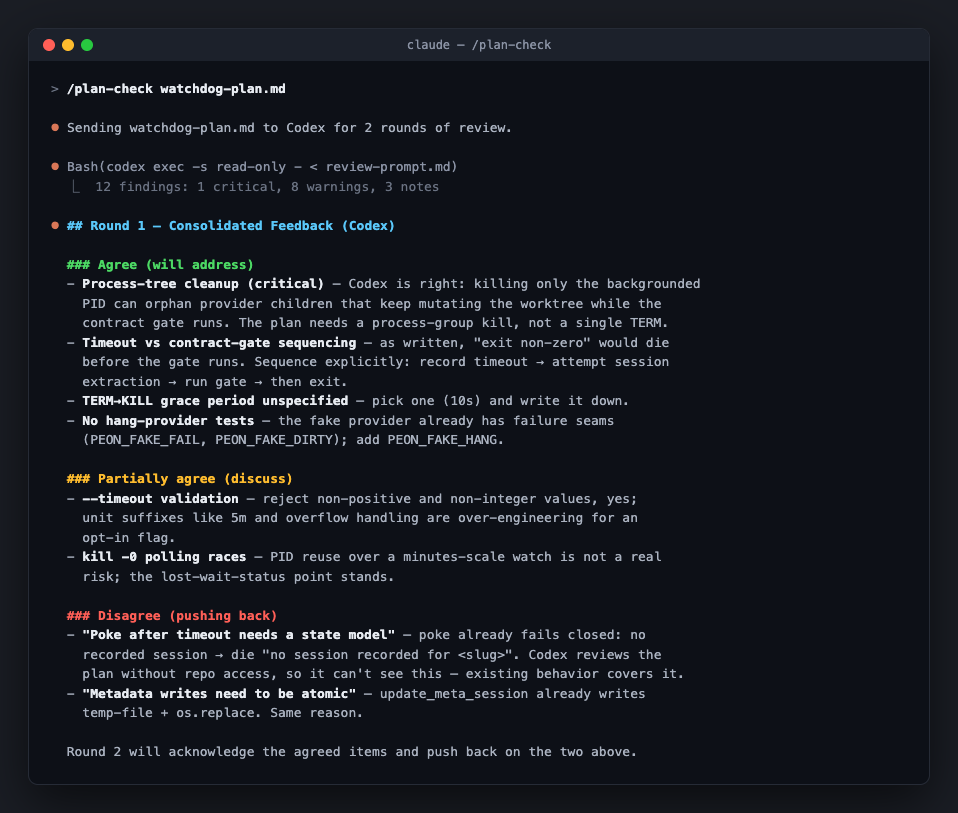

# codex-and-grok-and-gemini-in-claude (now with peons)


```
                opinions in                              labor out
             ◀───────────────                        ───────────────▶

 ┌───────────────────┐                ╔═════════════╗               ┌───────────────────┐
 │     reviewers     │ ◀─── plan ─── ║   CLAUDE    ║ ─── task ───▶ │       peons       │
 │ codex grok gemini │ ─ findings ─▶ ║  (foreman)  ║ ◀── report ── │ codex grok gemini │
 └───────────────────┘                ╚═════════════╝               └───────────────────┘
    read-only sandboxes            mediates · reviews             isolated worktrees
       /plan-check                      merges                    /peon-poke  "zug zug"
```

> Opinions in. Labor out. Nothing lands without the foreman's review.

Two Claude Code skills that put external CLI agents (Codex, Grok, Gemini via gemini-cli or Antigravity) to work *for* Claude instead of alongside it:

- **`/plan-check`** pulls **opinions in** — second-opinion plan review, solo or as a parallel "council", with Claude mediating every round.
- **`/peon-poke`** pushes **labor out** — implementation chores farmed to a "peon" in an isolated git worktree, reviewed and merged by Claude.

Claude stays the foreman because Claude has your conversation context — it knows things the reviewers and peons do not. Reviewer feedback gets triaged, not parroted; peon diffs get code-reviewed, not rubber-stamped.



## Install

### One-liner

```bash
git clone https://github.com/ytubecoder/codex-in-claude.git ~/codex-in-claude && cd ~/codex-in-claude && \
mkdir -p ~/.claude/skills/plan-check ~/.claude/skills/peon-poke ~/.local/bin && \
ln -sf "$(pwd)/skills/plan-check/SKILL.md" ~/.claude/skills/plan-check/SKILL.md && \
ln -sf "$(pwd)/skills/peon-poke/SKILL.md"  ~/.claude/skills/peon-poke/SKILL.md && \
ln -sf "$(pwd)/bin/peon" ~/.local/bin/peon
```

Symlinks mean `git pull` upgrades you. Clone anywhere you like; `~/.local/bin` can be any writable `PATH` dir. Restart Claude Code (or start a new session) to pick up the skills.

### Or tell your agent

> Clone https://github.com/ytubecoder/codex-in-claude to ~/codex-in-claude, symlink skills/plan-check/SKILL.md to ~/.claude/skills/plan-check/SKILL.md and skills/peon-poke/SKILL.md to ~/.claude/skills/peon-poke/SKILL.md, and symlink bin/peon into a directory on my PATH.

**Upgrading from the single-skill layout:** `SKILL.md` moved to `skills/plan-check/SKILL.md`. If you symlinked the old root `SKILL.md`, the link is now dangling — re-run the symlink line above.

## `/plan-check` — opinions in

When you've written a plan (design doc, spec, architecture note) and want another set of eyes on it, this skill sends it to Codex and/or Grok and has Claude critically evaluate what comes back. Reviewers run in read-only sandboxes and never touch your files.

```
  ┌──────────┐    ┌──────────┐    ┌──────────┐    ┌──────────┐
  │ ROUND 1  │───▶│  TRIAGE  │───▶│ ROUND 2+ │───▶│ VERDICT  │
  └──────────┘    └──────────┘    └──────────┘    └──────────┘
   identical       agree /         resume the      ready / needs
   prompt to all   partially /     sessions,       revision — you
   reviewers, in   disagree        negotiate,      decide the
   parallel                        narrow          stalemates
```

Default is 2 rounds. **Council mode** sends the identical prompt to all reviewers in parallel and merges their findings with attribution (*All* / *Codex+Gemini* / *Grok only* / …). Reviewers never see each other's round-1 output — independent takes are the point. Consensus findings carry extra weight; single-reviewer findings get extra scrutiny.

| Invocation | Behavior |
|---|---|
| `/plan-check` | Auto-detects plan files, reviews with Codex |
| `/plan-check grok` | Reviews with Grok |
| `/plan-check gemini` | Reviews with Gemini models (routes to `agy` on consumer subscriptions) |
| `/plan-check agy` | Reviews with Antigravity |
| `/plan-check council` | Reviews with all reviewers in parallel |
| `/plan-check path/to/plan.md` | Reviews a specific file |
| `/plan-check 3` | Runs 3 rounds instead of the default 2 |

Modifiers combine: `/plan-check council 3 docs/plan.md`. Trigger phrases work too — "get codex to check this", "what does grok think", "second opinion on this plan".



## `/peon-poke` — labor out

Give Claude an implementation chore to delegate ("have codex build the pagination", "farm the test backfill out to grok") and it dispatches a peon: an isolated git worktree on a `peon/<slug>` branch where the provider CLI works with write access, commits its changes, and files a `PEON_REPORT.md`. Nothing reaches your working tree without review and an explicit merge.

The trust model throughout: everything the peon *says* — report prose, pasted test output — is advisory. The gates that decide (contract, file scope, verify) are computed foreman-side from git facts and foreman-run commands, so delegation saves tokens without taking the worker's word for anything.

```
  ┌──────────┐    ┌──────────┐    ┌──────────┐    ┌──────────┐    ┌──────────┐
  │ DISPATCH │───▶│   WORK   │───▶│  REPORT  │───▶│  REVIEW  │───▶│  MERGE   │
  └──────────┘    └──────────┘    └──────────┘    └──────────┘    └──────────┘
   worktree +      provider        PEON_REPORT     foreman reads    explicit
   peon/<slug>     commits in      + commits +     report + diff    merge only —
   branch          isolation       clean tree      poke ⟲ / scrap   or scrap
```

| Step | What happens | Gate |
|------|-------------|------|
| **1. Scope** | Claude tightens the chore into one well-defined task with acceptance criteria and file paths. Peons execute; they don't design. A task so small you'd read its whole diff anyway never dispatches at all — the orchestrator does it directly. | Task is unambiguous AND net token-saving to delegate |
| **2. Dispatch** | `peon dispatch codex "<task>"` creates the worktree and branch, then runs the provider inside it. | Clean repo, or explicit `--force` |
| **3. Work** | The peon implements, commits, and files `PEON_REPORT.md`. | **Contract gate:** commits made + report committed + clean tree. Violations fail loudly, worktree preserved for inspection |
| **4. Review** | One of four treatments, picked by size and risk — classic full-diff read, spot review, black-box acceptance, or test-gated dispatch (table below). | One full treatment per merge — never none |
| **5. Poke** ⟲ | `peon poke <slug> "<feedback>"` resumes the same provider session for revisions. Repeat until right. | No-op revision rounds fail loudly |
| **6. Merge** | `peon merge <slug>` lands it on your branch, strips the report, cleans up. `peon scrap` discards. | Nothing auto-lands, ever |

### The four review treatments

The economics of farming work out live or die on acceptance cost, so the treatment scales with the task instead of being one-size-fits-all. The standing gate sits before all of them: delegation must SAVE orchestrator tokens — a task small enough that you'd read the whole diff anyway never goes to a peon; the orchestrator just does it. The verify-backed tiers (spot, black-box, test-gated) are where the savings live: the orchestrator reads tests and hunks, never implementations. Whatever you pick, the peon's own words are never the gate — the mechanical gates are.

| Treatment | For | What the orchestrator spends |
|---|---|---|
| **Classic** — read the full diff | suite-less repos or style-is-the-point tasks, only when reading the diff beats producing it | reading the whole diff |
| **Spot** — foreman-run verify + diffstat + load-bearing hunks | mid-size self-tested chores | a few hunks |
| **Black-box** — spec + `--allow`/`--verify`, `check`, test audit, independent probes | large spec-driven features | writing the spec; reading only the tests |
| **Test-gated** — foreman authors failing tests; the peon's task is "make these green" | high-risk work (auth, billing, migrations) | writing the tests once — implementations are never read, and every poke round re-gates for free |

Picking one is an ordered check, not a judgment call — first hit wins: so small you'd read the whole diff anyway → **no dispatch** (do it directly); no runnable suite or style-is-the-point, and the diff is still cheaper to read than produce → **classic**; high blast radius (auth, billing, migrations) → **test-gated**; spec cheaper than reading the diff (>5 files / ~300+ lines) → **black-box**; otherwise → **spot**. In doubt, take the tier with more verification, not more diff-reading.

Test-gated dispatch needs no extra flags: commit the tests, run the verify once to prove them red on base, then dispatch with `--verify` pointing at them and an `--allow` that *excludes* the test paths — any peon edit to a test file is then a scope violation, which is the read-only lock. Full detail on the last three: [docs/BLACKBOX-ACCEPTANCE.md](docs/BLACKBOX-ACCEPTANCE.md).

The mechanics live in `bin/peon` — a dependency-light shell script (git + python3 + uuidgen) any orchestrator can call, not just Claude:

```
peon dispatch <codex|grok|gemini|agy> "<task>" [--repo DIR] [--base REF] [--slug NAME] [--force]
              [--allow "glob[,glob...]"] [--verify "cmd"]
peon list | report <slug> | diff <slug> [--stat|--files]   # report includes provider-reported token usage

peon check <slug>              # contract + scope + foreman-run verify, recorded vs branch tip
peon adopt <slug> [-m "msg"]   # foreman-commit work a sandbox-blocked provider left uncommitted
peon poke <slug> "<feedback>"
peon merge <slug> [--unchecked] | scrap <slug>
```

Exit codes are orchestrator-friendly: `1` means the dispatch itself was wrong (usage, environment, provider error); `3` means the *peon* broke its contract, with worktree and metadata preserved for inspection. Some provider sandboxes can't run `git` in a linked worktree at all (grok): the peon finishes the work and the report but can't commit, dispatch exits 3, and `peon adopt` foreman-commits it on the peon branch — an expected path, not a crash. Review still decides the merge.

State lives under `~/.peon/` by default (worktrees, logs, metadata), overridable via `PEON_HOME` — never inside your repo.

## Requirements

- [Claude Code](https://claude.com/claude-code)
- At least one provider CLI, installed, authenticated, and on `PATH`:
  - [Codex CLI](https://github.com/openai/codex) (`codex`)
  - [Grok Build CLI](https://docs.x.ai/) (`grok`)
  - [Antigravity CLI](https://antigravity.google/product/antigravity-cli) (`agy`) — Gemini (plus Claude and GPT-OSS) models on a Google AI Pro/Ultra subscription, so peon labor can ride credits you may already pay for
  - [Gemini CLI](https://github.com/google-gemini/gemini-cli) (`gemini`) — enterprise/API-key setups only: Google cut gemini-cli off from consumer accounts (free, AI Pro, Ultra) on 2026-06-18; those subscriptions now go through `agy`
- For peon-poke: `git`, `python3`, `uuidgen` (all standard on macOS/Linux)

## Tests

`bash tests/peon.test.sh` — deterministic lifecycle tests using a built-in fake provider and a dry-run seam; no provider CLIs needed, no cost.

## License

MIT

**Works inside:** [Claude Code](https://claude.com/claude-code) · **Puts to work:** [Codex CLI](https://github.com/openai/codex), [Grok Build CLI](https://docs.x.ai/) · `bin/peon` is orchestrator-agnostic — any agent that can run shell commands can be the foreman
